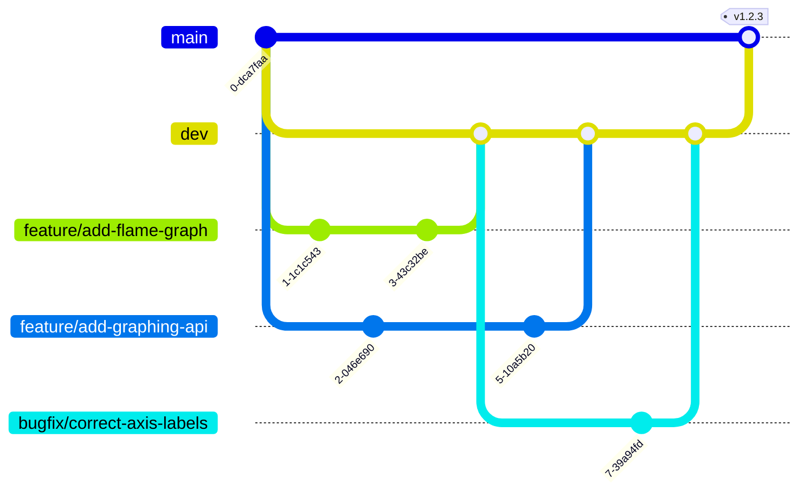

# Contributing

### Committing and Commit Messages

Infernode now uses [Semantic-Release](https://github.com/semantic-release/semantic-release/blob/master/README.md) and [Commitizen](https://github.com/commitizen/cz-cli/blob/master/README.md)
to automatically handle versioning. As a result, when using `git commit` or `npm run commit` to comply with formatting implemented by Semantic-Release. Upon execution of either command,
Commitizen will walk the user through how to author commit messages in the command line.

Steps:

- Run ```git add <files>``` when ready to stage changes
- Run ```npm run commit``` or ```git commit``` to format commit messages using Commitizen
- When ready, push changes up to a branch made for the changes

### Pull Requests

- Development should be performed on branches from `dev` and PR'd back to `dev` once complete,
- Releases will be performed by PRing to `main`.
- Pull Requests to `dev` and `main` are blocked on passing GHA checks. In order to ensure your PR will pass checks, make sure that:
  - All new dependencies have been included in package.json/package-lock.json
  - All tests are passing locally via `npm test`
  - All ESLint checks pass locally via `npm run lint`
  - A new build is successful locally via `npm run build`
  - The app is functional in production mode via `npm run build && npm start` and browsing to <http://localhost:3000>

Please consider the following when filing pull requests:

- Update working branch from dev
- Test the above GHA check criteria locally
- PR title should take the form of a Commitizen commit title
- Body of PR should take the form of a Commitizen commit body
- Once approved, the PR author is responsible for squash merging into the destination branch
- Branches should be deleted after merge

### Branch Names



- Use a new branch for each new feature and eventual PR
- Use the format of "type/descriptive-outcome"
- Types include:
  - bugfix
  - feature
  - docs
  - testing
  - refactor
  - cicd
- The descriptive-outcome should describe what will be achieved by merging the branch
