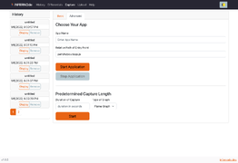
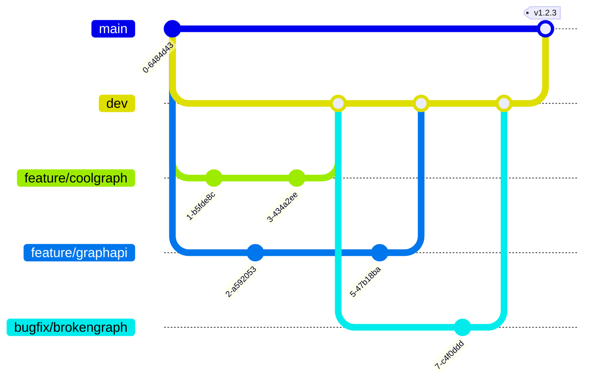

# infernode

A process tracing and flame graph tool for node.js development


[INFERNOde Website](https://www.infernode.dev)

[Documentation and Features](https://www.infernode.dev/Documentation/doc2.html)

[Contact the developers](mailto:team@infernode.dev)

## Usage

1. `npm install --save-dev infernode` in your Node.JS NPM project
1. `npx infernode` to launch INFERNOde
1. Navigate to the **Capture** page
1. Provide the path to your app's entrypoint, relative to the top level directory of your project (e.g. `src/index.js`)
1. Set a time limit for your capture and hit start
1. If necessary, interact with your app to trigger the functionality you want to trace
1. Check out the new flame graph in the sidebar

## Interface

<a href="docs/images/infernode-history-page.png"><figure>
<figcaption>View and Manage Existing Graphs</figcaption></figure></a>

<a href="docs/images/infernode-diff-page.png"><figure>
<figcaption>Generate Differential Graphs</figcaption></figure></a>

<a href="docs/images/infernode-basic-capture-page.png"><figure>
<figcaption>One-click Captures</figcaption></figure></a>

<a href="docs/images/infernode-advanced-capture-page.png"><figure>
<figcaption>Flexible Capture Settings</figcaption></figure></a>

<a href="docs/images/infernode-upload-page.png"><figure>
<figcaption>Upload Existing `perf` Files</figcaption></figure></a>

<a href="docs/images/infernode-help-page.png"><figure>
<figcaption>In-app Help</figcaption></figure></a>

## Architecture


### Live App Capture Request


### Key Dependencies

#### Backend

- TypeScript
- Node.js
- Express.js
- SQLite3
- Pino
- Formidable

#### Frontend

- TypeScript
- React
- React-Router
- React-Bootstrap
- Axios

#### CI/CD

- Github Actions
- Jest
- Supertest
- Semantic-Release
- Stylelint
- ESLint
- Webpack


## Developing

1. Clone this repository
1. `npm install` in the repo directory
1. `npm run dev` to run the server with on-save recompile/reload

### Additional project scripts

All scripts are accessible via `npm run <scriptname>`, some key scripts are:

- `resetdb`: Clean out infernode's datastore for a fresh start
- `clean`: Remove all contents of the `./dist/` directory
- `copy-assets`:  Copy static assets from `./src/` to `./dist/`
- `lint`:  Run linter (ESLint) against the relevant client and server source code
- `build`: Performs `npm run prebuild`, `npm run tsc`, and `npm run webpack` sequentially, will halt if any `prebuild` steps have non-zero exit codes
- `test`: Performs a fresh `build` and then executes all test suites
- `start`: Starts the `node` server in production mode, access via <http://localhost:3000>
- `dev`: Starts the `node` and `webpack-dev-server` servers in development mode, both dynamically recompiling/bundling/restarting on source code changes, access via <http://localhost:8080>

### Express.js Global Error Handler

- Invoked via `next( errObject: InfernodeError )`.
- Takes an `InfernodeError` type object with the following mandatory properties:
  - `message: string`: A technical error message not necessarily intended for end users
- The `InfernodeError` object can optionally include:
  - `userMessage: string`: A non-technical error message intended for (public) end users or API consumers
  - `httpStatus: number`: A more specific HTTP status code to use for the response
  - `controller: string`: The Express middleware controller/function/method/operation that caused the error
- Logs the entire error object + the request method and path to the server's console.
- The response status will be set to 500 by default if an `errObject.httpStatus` code is not provided.
- In development mode, entire error object, request method, and request path will be sent in the HTTP response body as JSON.
- In production mode, only the errObject.userMessage will be sent in the HTTP response body as JSON.

## Contributing

### Committing and Commit Messages

Infernode now uses [Semantic-Release](https://github.com/semantic-release/semantic-release/blob/master/README.md) and [Commitizen](https://github.com/commitizen/cz-cli/blob/master/README.md)
to automatically handle versioning. As a result, when using `git commit` or `npm run commit` to comply with formatting implemented by Semantic-Release. Upon execution of either command,
Commitizen will walk the user through how to author commit messages in the command line.

Steps:

- Run ```git add <files>``` when ready to stage changes
- Run ```npm run commit``` or ```git commit``` to format commit messages using Commitizen
- When ready, push changes up to a branch made for the changes

### Pull Requests

- Development should be performed on branches from `dev` and PR'd back to `dev` once complete,
- Releases will be performed by PRing to `main`.
- Pull Requests to `dev` and `main` are blocked on passing GHA checks. In order to ensure your PR will pass checks, make sure that:
  - All new dependencies have been included in package.json/package-lock.json
  - All tests are passing locally via `npm test`
  - All ESLint checks pass locally via `npm run lint`
  - A new build is successful locally via `npm run build`
  - The app is functional in production mode via `npm run build && npm start` and browsing to <http://localhost:3000>

Please consider the following when filing pull requests:

- Update working branch from dev
- Test the above GHA check criteria locally
- PR title should take the form of a Commitizen commit title
- Body of PR should take the form of a Commitizen commit body
- Once approved, the PR author is responsible for squash merging into the destination branch
- Branches should be deleted after merge

### Branch Names



- Use a new branch for each new feature and eventual PR
- Use the format of "type/descriptive-outcome"
- Types include:
  - bugfix
  - feature
  - docs
  - testing
  - refactor
  - cicd
- The descriptive-outcome should describe what will be achieved by merging the branch
