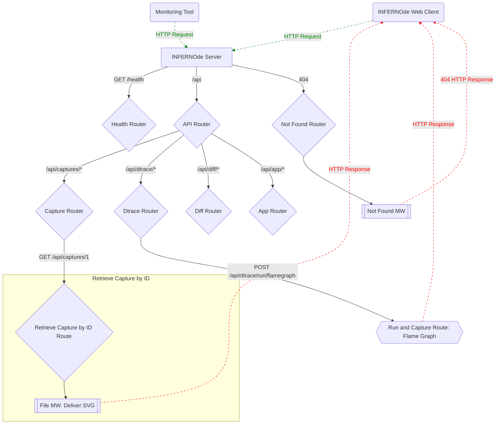
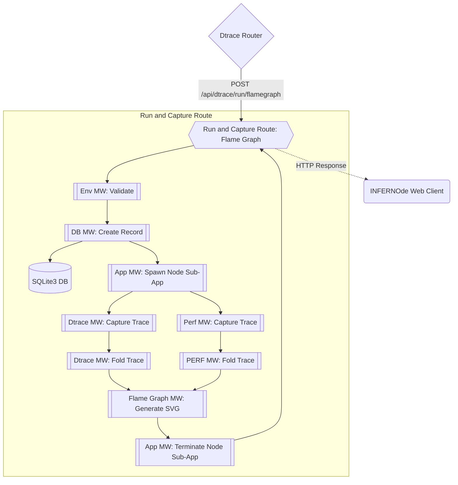

# Architecture Diagrams

```mermaid
graph TD;
    C("INFERNOde Web Client") -.-> |"HTTP Request"| S["INFERNOde Server"];
    linkStyle 0 stroke:green,color:green,stroke-dasharray: 5 5;
    CM("Monitoring Tool") -.-> |"HTTP Request"| S
    linkStyle 1 stroke:green,color:green,stroke-dasharray: 5 5;
    S --> |"GET /health"| RH{"Health Router"};
    S --> |"/api"| RA{"API Router"};
    S --> |"404"| RNF{"Not Found Router"};
    RNF --> MNF[["Not Found MW"]];
    MNF -.-> |"404 HTTP Response"| C;
    linkStyle 6 stroke:red,color:red,stroke-dasharray: 5 5;
    RA --> |"/api/captures/*"| RC{"Capture Router"};
    RA --> |"/api/dtrace/*"| RT{"Dtrace Router"};
    RA --> |"/api/diff/*"| RD{"Diff Router"};
    RA --> |"/api/app/*"| RAP{"App Router"};
    RT --> |"POST /api/dtrace/run/flamegraph"| RRC{{"Run and Capture Route: Flame Graph"}};
    RRC -.-> |"HTTP Response"| C;
    linkStyle 12 stroke:red,color:red,stroke-dasharray: 5 5;
    RC --> |"GET /api/captures/1"| RCG1{"Retrieve Capture by ID Route"};
    subgraph "Retrieve Capture by ID ";
    RCG1 --> MFD[["File MW: Deliver SVG"]];
    end;
    MFD -.-> |"HTTP Response"| C;
    linkStyle 15 stroke:red,color:red,stroke-dasharray: 5 5;
```

```mermaid
graph TD;
    RT{"Dtrace Router"} --> |"POST /api/dtrace/run/flamegraph"| RRC{{"Run and Capture Route: Flame Graph"}};
    subgraph "Run and Capture Route";
    RRC --> ME[["Env MW: Validate"]];
    ME --> MDB[["DB MW: Create Record"]];
    MDB --> SQL[("SQLite3 DB")];
    MDB --> MA1[["App MW: Spawn Node Sub-App"]];
    MA1 --> MDT1[["Dtrace MW: Capture Trace"]];
    MA1 --> MPT1[["Perf MW: Capture Trace"]];
    MDT1 --> MDT2[["Dtrace MW: Fold Trace"]];
    MPT1 --> MPT2[["PERF MW: Fold Trace"]];
    MDT2 --> MFG[["Flame Graph MW: Generate SVG"]];
    MPT2 --> MFG;
    MFG --> MA2[["App MW: Terminate Node Sub-App"]];
    MA2 --> RRC;
    end;
    RRC -.-> |"HTTP Response"| C("INFERNOde Web Client");
```
